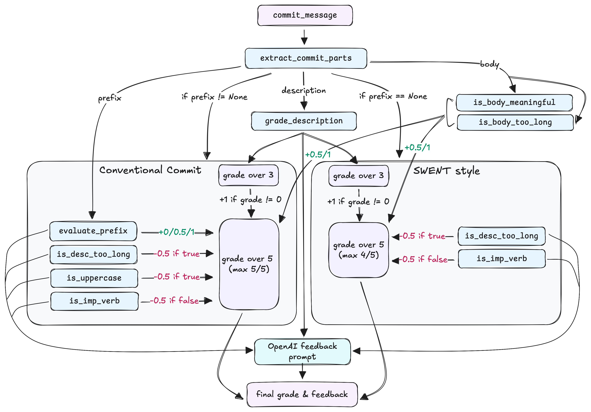

# **Commit Grading and Feedback System**

A system for grading commit messages and generating actionable feedback to improve adherence to best practices in commit writing. This repository includes tools for automated grading and feedback generation using GPT.

---

## **Table of Contents**
1. [Introduction](#introduction)
2. [Features](#features)
3. [Getting Started](#getting-started)
   - [Prerequisites](#prerequisites)
   - [Installation](#installation)
4. [Usage](#usage)
   - [Examples](#examples)
5. [Functions](#functions)
   - [Function Descriptions](#function-descriptions)
6. [Datasets](#datasets)
7. [Grading Guidelines](#grading-guidelines)
8. [Contributing](#contributing)
9. [License](#license)
10. [Acknowledgements](#acknowledgements)

---

## **Introduction**

Developed as part of the Machine Learning (CS-433) course project, this work automates the evaluation of commit messages and provides constructive feedback. In collaboration with the Dependable Systems Lab at EPFL, led by Professor George Candea, we designed this system for the SWENT (CS-311) course, where students write commit messages as part of their software development projects.

The system evaluates the quality of commit messages based on established best practices, such as conventional commit guidelines, and generates actionable feedback to help students improve their writing. By leveraging BERT-based models for grading and GPT-based models for feedback generation, the system promotes better version control practices and enhances the learning experience for students.

---

## **Features**
- Grading of commit messages based on clarity, structure, and adherence to best practices.
- Dynamic feedback generation using GPT-4o with structured prompts.
- Hyperparameter tuning for optimizing model performance.
- Support for SWENT-style and conventional commit standards.
- Comprehensive evaluation metrics (see `Metrics.ipynb` for more details).

---

## **Getting Started**

### **Prerequisites**
- Python 3.8 or above
- Required Python libraries listed in `requirements.txt`

### **Installation**
1. Clone the repository:
    ```bash
    git clone https://github.com/your-repo-name.git
    cd your-repo-name
    ```

2. Install dependencies:
    ```bash
    pip install -r requirements.txt
    ```
> [!WARNING]
> In order to download the Spacy model that we use, please make sure to run the following command:
> 
> `python -m spacy download en_core_web_sm`


    
> [!IMPORTANT]
> To use the `transformers` and `datasets` libraries, you need to create a Hugging Face account and configure the libraries:
> - Go to [Hugging Face](https://huggingface.co/) and create an account.
> - After logging in, install the Hugging Face CLI:
>     ```bash
>     pip install huggingface_hub
>     ```
> - Log in to the Hugging Face CLI:
>     ```bash
>     huggingface-cli login
>     ```
>   Enter your Hugging Face API token when prompted. You can get your token from your [Hugging Face account settings](https://huggingface.co/settings/tokens).

3. Train the model:
    Open the `train.ipynb` notebook in Jupyter Notebook or Jupyter Lab, and run all the cells. This will train the model and save the output for commit message grading.
> [!NOTE]
> The training process might take some time depending on the processor of the machine it’s run on. If you are using an Apple Sillicon chip, GPU acceleration might not work as expected. The training will fall back to CPU, which may result in slower performance.
> 
> Additionally, if you encounter an error (such as an MPS error), it should be handled accordingly.

4. Obtain the API Key:
    Since the code requires an API key for generating feedback, please contact me at [albert.fares@epfl.ch](mailto:albert.fares@epfl.ch) to request my personal API key.
> [!WARNING]
>    - **Usage Guidelines:**
>      - Please use the key responsibly, as it is tied to my personal account and has limited funds.
>      - Avoid excessive testing to conserve the available funds.
>    - If any issues arise or additional funds are needed, feel free to reach out, and I will assist you accordingly.
   
## **Usage**

### **Examples**
##### *(The functions below are in the `run.ipynb` notebook)*

#### 1. Process a single commit message:
You can grade a single commit message and generate feedback using the `process_single_commit` function.

```python
from helpers import process_single_commit

bert_model_path = "bert_grade_model/"

commit_message = "feat: add user authentication"
result = process_single_commit(commit_message, bert_model_path)
```
#### 2. Process commit messages grouped by SCIPER:
To process multiple commit messages grouped by SCIPER, generate feedback, and calculate average grades, use the `process_commits_and_generate_feedback_with_sciper` function.

```python
from helpers import process_commits_and_generate_feedback_with_sciper

input_json_path = "testing_data.json"
output_json_path = "output_feedback.json"

bert_model_path = "bert_grade_model/"

# Set your api key here
openai.api_key = ""

# Process a subset of SCIPERs
results = process_commits_and_generate_feedback_with_sciper(input_json_path, output_json_path, bert_model_path, start = 0, end = 2)

# Process all SCIPERs
results = process_commits_and_generate_feedback_with_sciper(input_json_path, output_json_path, bert_model_path)
```

##### **Input JSON Format**

The input JSON file should be structured as follows, where each **SCIPER** ID maps to a list of commit objects containing a `hash` and a `commit message`:

```json
{
    "123456": [
        {
            "hash": "675f7201cce20ae7f757324909b9a87ab474873c",
            "commit_message": "test: Add ui tests for the map screen"
        },
        {
            "hash": "117406f8b77ef98ce6b8e1fe89bed3c8a816eafe",
            "commit_message": "test: Add unit tests for ListToDosViewModel and ToDosRepositoryFirestore"
        }
    ],
}
```
This structure is essential for the process_commits_and_generate_feedback_with_sciper function to process the data correctly.

##### Example output:

```json
"123456": {
        "commits": [
            {
                "hash": "675f7201cce20ae7f757324909b9a87ab474873c",
                "commit_message": "test: Add ui tests for the map screen",
                "grade": 4.5,
                "feedback": "The commit message should start the description with a lowercase letter to align with conventional commit message guidelines."
            },
            {
                "hash": "117406f8b77ef98ce6b8e1fe89bed3c8a816eafe",
                "commit_message": "test: Add unit tests for ListToDosViewModel and ToDosRepositoryFirestore",
                "grade": 4.0,
                "feedback": "The identified issue is that the commit message description is too long and should be concise, ideally under 50 characters, to improve readability. Additionally, the description starts with an uppercase letter, whereas conventional commit messages typically start with a lowercase letter."
            }
        ],
        "average_grade": 4.17
},
```


---

## **Functions**

### **Function Descriptions**

#### `train_bert_for_grading(json_path, output_dir="./bert_grade_model", num_epochs=3, batch_size=16, learning_rate=2e-5, weight_decay=0.0)`
- **Description:** Trains a BERT model for commit message grading using a labeled dataset.
- **Inputs:**
  - `json_path` (str): Path to the JSON file containing `commit_message` and `grade` fields.
  - `output_dir` (str): Path to save the trained model and tokenizer.
  - `num_epochs` (int): Number of training epochs.
  - `batch_size` (int): Batch size for training.
  - `learning_rate` (float): Learning rate for the optimizer.
  - `weight_decay` (float): Weight decay for regularization.
- **Outputs:**
  - Saves the trained BERT model and tokenizer in the specified `output_dir`.


#### `extract_commit_parts(commit_message)`
- **Description:** Extracts the prefix, description, and body from a commit message.
- **Inputs:** 
  - `commit_message` (str): The full commit message.
- **Outputs:** A dictionary containing:
  - `prefix` (str): Extracted prefix if valid.
  - `description` (str): Message description after the prefix.
  - `body` (str): The body of the commit message.


#### `evaluate_prefix(prefix)`
- **Description:** Evaluates whether a prefix is valid according to the Conventional Commit standard and returns a grade.
- **Inputs:** 
  - `prefix` (str): The prefix to evaluate.
- **Outputs:** A dictionary containing:
  - `grade` (float): Grade of the prefix (0, 0.5, or 1).
  - `error_code` (int): Error type:
    - `0`: Perfect prefix.
    - `1`: Uppercase error.
    - `2`: Typo error.
    - `3`: Both uppercase and typo errors.
    - `4`: Invalid prefix.


#### `grade_description(commit_message, tokenizer, model)`
- **Description:** Grades the description of a commit message using a pre-trained BERT model.
- **Inputs:**
  - `commit_message` (str): The full commit message to grade.
  - `tokenizer`: The tokenizer loaded with the pre-trained BERT model.
  - `model`: The trained BERT model used for grading.
- **Outputs:**
  - An integer representing the predicted grade (0, 1, 2, or 3).


#### `is_body_meaningful(description, body, no_openai=True)`
- **Description:** Evaluates whether the body of a commit message adds meaningful information to its description. The evaluation can be done using a simplified rule-based approach (if `no_openai` is `True`) or by leveraging GPT-4o (if `no_openai` is `False`).
- **Inputs:**
  - `description` (str): The description (title) of the commit message.
  - `body` (str): The body of the commit message.
  - `no_openai` (bool, optional): If `True`, the function assumes the body is meaningful if it exists. Defaults to `True`.
- **Outputs:** 
  - `True` if the body is meaningful, `False` otherwise.


#### `is_desc_too_long(content)`
- **Description:** Checks if the commit message description exceeds 50 characters (excluding spaces).
- **Inputs:**
  - `content` (str): The commit message description.
- **Outputs:** 
  - `True` if the description is too long, `False` otherwise.


#### `is_body_too_long(body)`
- **Description:** Checks if any line in the commit message body exceeds 72 characters.
- **Inputs:**
  - `body` (str): The body of the commit message.
- **Outputs:** 
  - `True` if any line exceeds 72 characters, `False` otherwise.


#### `is_uppercase(content)`
- **Description:** Checks if the first letter of the commit message description is uppercase.
- **Inputs:**
  - `content` (str): The commit message description.
- **Outputs:** 
  - `True` if the first letter is uppercase, `False` otherwise.


#### `is_imp_verb(sentence, nlp)`
- **Description:** Determines if the first word of a commit message description is a verb in imperative mood using a SpaCy model.
- **Inputs:**
  - `sentence` (str): The commit message description to analyze.
  - `nlp`: A loaded SpaCy language model used for natural language processing.
- **Outputs:** 
  - `True` if the first word is a verb in imperative mood, `False` otherwise.
  

#### `grade_commit_message(commit_message, nlp, tokenizer, model, no_openai=True)`
- **Description:** Grades a commit message by evaluating its prefix, description, and body, while checking for errors and adherence to best practices.
- **Inputs:**
  - `commit_message` (str): The full commit message to grade.
  - `nlp`: A loaded SpaCy language model used for natural language processing.
  - `tokenizer`: A preloaded tokenizer for the BERT model.
  - `model`: A preloaded BERT model used for evaluating the description grade.
  - `no_openai` (bool): If `True`, body evaluation defaults to `True` without using GPT for evaluation.

- **Outputs:** A tuple containing:
  - `description_grade` (int): Initial description grade (0–3).
  - `final_grade` (float): Adjusted final grade after applying all checks and adjustments.
  - Various boolean flags indicating detected issues:
    - `is_desc_too_long` (bool): `True` if the description exceeds 50 characters (excluding spaces).
    - `is_uppercase` (bool): `True` if the first letter of the description is uppercase (only for conventional commit messages).
    - `is_not_imp_verb` (bool): `True` if the description does not start with an imperative verb (checked using SpaCy).
    - `is_perfect_prefix` (bool): `True` if the prefix is valid and correctly formatted.
    - `is_uppercase_prefix` (bool): `True` if the prefix has an uppercase error.
    - `is_typo_prefix` (bool): `True` if the prefix contains a typo.
    - `is_uppercase_and_typo_prefix` (bool): `True` if the prefix has both uppercase and typo errors.
    - `is_invalid_prefix` (bool): `True` if the prefix is invalid or non-standard.
    - `is_body_meaningful` (bool): `True` if the body adds meaningful context to the description.
    - `is_body_too_long` (bool): `True` if any line in the body exceeds 72 characters (excluding spaces).
    - `is_body_evaluated` (bool): `True` if the body has been evaluated for meaningfulness.


#### `extract_commit_messages(json_path)`
- **Description:** Extracts commit messages from a JSON file.
- **Inputs:**
  - `json_path` (str): Path to the JSON file.
- **Outputs:** A list of commit messages.


#### `extract_grades(json_path)`
- **Description:** Extracts grades from a JSON file.
- **Inputs:**
  - `json_path` (str): Path to the JSON file.
- **Outputs:** A list of grades.


#### `actual_vs_pred(commit_messages, validation_grades, num_messages, nlp, tokenizer, model, no_openai=True)`
- **Description:** Validates commit message grades by grading a subset of messages and comparing them with validation grades. Calculates accuracy, custom F1-like metrics, and flags mismatched grades for detailed analysis.
- **Inputs:**
  - `commit_messages` (list): List of commit messages to validate.
  - `validation_grades` (list): List of ground-truth validation grades.
  - `num_messages` (int): Number of commit messages to validate (processed sequentially from the beginning).
  - `nlp`: A loaded SpaCy language model for natural language processing.
  - `tokenizer`: A preloaded tokenizer for the BERT model.
  - `model`: A preloaded BERT model for evaluating the description grades.
  - `no_openai` (bool): If `True`, body evaluation defaults to meaningful if present without using GPT.

- **Outputs:** A dictionary containing:
  - `flagged_messages` (list): A list of messages with mismatched grades, along with detailed results:
    - Commit message.
    - Predicted grade.
    - Validation grade.
    - Detected errors and their flags.
  - `custom_accuracy` (float): Fraction of predictions within the error margin (default is 1).
  - `custom_f1` (float): A custom F1-like metric adapted for continuous grade values.


#### `generate_feedback(commit_message, final_grade, description_grade, errors)`
- **Description:** Generates targeted feedback for a commit message using GPT-4o based on the detected issues.
- **Inputs:**
  - `commit_message` (str): The full commit message.
  - `final_grade` (float): Final grade of the commit.
  - `description_grade` (int): Intermediate description grade.
  - `errors` (dict): Dictionary of error flags.
- **Outputs:** 
  - A string containing the feedback.


#### `process_commits_and_generate_feedback(input_json_path, output_json_path, start=None, end=None)`
- **Description:** Processes commit messages from a JSON file, grades them, and generates feedback.
- **Inputs:**
  - `input_json_path` (str): Path to the input JSON file.
  - `output_json_path` (str): Path to save the graded commit messages with feedback.
  - `start` (int, optional): Start index for processing commits.
  - `end` (int, optional): End index for processing commits.
- **Outputs:** A list of processed commit messages with grades and feedback.


#### `extract_commit_messages_per_sciper(json_path)`
- **Description:** Extracts commit messages grouped by SCIPER ID from a JSON file.
- **Inputs:**
  - `json_path` (str): Path to the JSON file.
- **Outputs:** A dictionary where keys are SCIPER IDs and values are lists of commit messages.


#### `process_commits_and_generate_feedback_with_sciper(input_json_path, output_json_path, model_path, spacy_nlp_name="en_core_web_sm", start=None, end=None)`
- **Description:** Processes commit messages grouped by SCIPER ID, generates grades and feedback, and calculates average grades using a trained BERT model and a specified SpaCy language model.
- **Inputs:**
  - `input_json_path` (str): Path to the input JSON file with commit messages grouped by SCIPER.
  - `output_json_path` (str): Path to save the graded results.
  - `model_path` (str): Path to the trained BERT model used for grading.
  - `spacy_nlp_name` (str, optional): The name of the SpaCy model to use. Defaults to `"en_core_web_sm"`.
  - `start` (int, optional): Starting index for SCIPER processing.
  - `end` (int, optional): Ending index for SCIPER processing.
- **Outputs:**
  - A JSON file containing commit messages, grades, feedback, and average grades per SCIPER.
- **Metrics Printed:**
  - Total execution time.
  - Average time per SCIPER.
  - Average time per commit.


#### `process_single_commit(commit_message, model_path, spacy_nlp_name="en_core_web_sm")`
- **Description:** Processes and grades a single commit message using a specified BERT model and SpaCy language model, then generates feedback.
- **Inputs:**
  - `commit_message` (str): The commit message to evaluate.
  - `model_path` (str): Path to the trained BERT model for grading.
  - `spacy_nlp_name` (str, optional): Name of the SpaCy model to use. Defaults to `"en_core_web_sm"`.
- **Outputs:**
  - A dictionary containing:
    - `commit_message` (str): The original commit message.
    - `grade` (float): The final grade assigned to the commit message.
    - `feedback` (str): Detailed feedback based on detected issues and grading criteria.
- **Notes:**
  - This function integrates both natural language processing (via SpaCy) and deep learning (via BERT) to provide a robust analysis of commit messages.

## **Datasets**

The project involves the use of three key datasets:

### **1. Old Training Data (`old_training_data`)**
- **Purpose:** Used for metric computation and to compare with the new and improved training dataset.
- **Description:** This dataset contains the original commit messages and grades, which served as the foundation for preprocessing and creating the improved training dataset. The grades in here are integers ranging from 0-5.

### **2. Training Data (`training_data`)**
- **Purpose:** Serves as the new training dataset to fine-tune the BERT-based classification model.
- **Description:** This dataset is the result of extensive preprocessing and improvements made to the old training data. It provides a clean and well-structured set of commit messages and corresponding grades for model training. The grades in here are integers ranging from 0-3.

### **3. Testing Data (`testing_data`)**
- **Purpose:** Used to test and evaluate the grading system's performance.
- **Description:** This dataset contains commit messages from 154 students who took the CS-311 course during the winter semester of the 2024-2025 academic period. It is used exclusively for testing purposes and should remain private to ensure student privacy. The commit messages in this dataset are not graded.
> [!WARNING]
> This dataset will be removed from the GitHub repository after the Machine Learning project grading to uphold the privacy of the students.

### **4. Validation Data (`validation_data`)**
- **Purpose:** Used to compute performance metrics in `Metrics.ipynb`
- **Description:** This dataset contains a different collection of graded commit messages compared to the training data (and the old training data). The grades are integers ranging from 0-5.
---


## **Metrics**

The `metrics.ipynb` file evaluates the grading system's performance using both the final and original datasets. It includes:

### **Key Features**
1. **Model Comparison:**
   - Compares models trained on the final and original datasets.
   - Outputs metrics such as accuracy, F1 scores, and confusion matrices.

2. **Validation:**
   - Validates predictions using `validation_data.json`.
   - Saves predictions for comparison (`y_final_pred.txt`, `y_old_pred.txt`).

3. **Visualization:**
   - Displays confusion matrices and classification reports for both datasets.

### **How to Use**
- Ensure the required datasets (`validation_data.json`) and models are available.
- Run the notebook to:
  - Compute predictions for commit messages.
  - Evaluate model performance.
  - Visualize results with confusion matrices.

> [!WARNING]
> The `validation_data.json` dataset contains sensitive information and will be removed post-grading to ensure privacy.

---

### **Grading Guidelines**

Below are the official grading guidelines followed by this project to evaluate commit messages:

1. **Description Grade (Out of 3):**
   - **3/3:** The description is clear and thoroughly describes the changes made.
   - **2/3:** The description is relatively clear but could benefit from improved wording or structure.
   - **1/3:** The description lacks sufficient detail and does not adequately describe the changes made.
   - **0/3:** The message is too vague, off-topic, or unrelated to code changes.

2. **Mapped Description Grade (Out of 4):**
   - \(0/3 -> 0/4\)
   - \(1/3 -> 1/4\)
   - \(2/3 -> 3/4\)
   - \(3/3 -> 4/4\)

3. **Prefix Evaluation (For Messages with Prefixes):**
   Only one scenario applies based on the state of the prefix:
   - **+1:** The prefix is perfect and adheres to conventional commit standards.
   - **+0.5:** The prefix has a minor typo but is still recognizable.
   - **+0.5:** The first letter of the prefix is uppercase.
   - **+0:** Both a typo and an uppercase letter are present in the prefix.
   - **+0:** The prefix is not one of the conventional prefixes.

4. **Body Evaluation (If a Body is Present):**
   Only one scenario applies based on the description grade and the body:
   - If the description grade is **1**:
     - **+1:** The body adds meaningful details to the description, and each line has fewer than 72 characters (excluding spaces).
     - **+0.5:** The body adds meaningful details, but some lines exceed 72 characters (excluding spaces).
     - **+0:** The body is not meaningful.
   - If the description grade is **2**:
     - **+0.5:** The body adds meaningful details, and each line has fewer than 72 characters (excluding spaces).
     - **+0:** Otherwise.
   - If the description grade is **0 or 3**, no bonus points are awarded for the body.

5. **Penalties (-0.5 Each):**
   - For messages with prefixes (conventional commit):
     - The description starts with an uppercase letter.
     - The description does not start with an imperative mood verb.
     - The description exceeds 50 characters (excluding spaces).
   - For messages without prefixes (SWENT-style):
     - The description does not start with an imperative mood verb.
     - The description exceeds 50 characters (excluding spaces).

> [!NOTE]
> For both **prefix** and **body evaluation**, only one scenario is applied per message. This ensures that the evaluation is precise and avoids applying multiple scores simultaneously.

---

## **Final Workflow**

The final workflow for the grading and feedback generation process is illustrated below.

### **Workflow Visualization**


The diagram provides an overview of the entire process, from dataset preparation to model evaluation and feedback generation.

---

## **Contributing**
We welcome contributions! To contribute:
1. Fork this repository.
2. Create a new branch:
    ```bash
    git checkout -b feature/your-feature-name
    ```
3. Commit your changes:
    ```bash
    git commit -m "Add your commit message here"
    ```
4. Push to the branch:
    ```bash
    git push origin feature/your-feature-name
    ```
5. Create a pull request.

---

## **License**
This project is licensed under the [MIT License](LICENSE).

---

## **Acknowledgements**
- [BERT](https://github.com/google-research/bert)
- [OpenAI GPT-4](https://openai.com/)
- [SpaCy](https://spacy.io/)
- Contributors: [Albert Fares](https://github.com/albertfares), [Hugo Jeannin](https://github.com/jeanninhugo), [Daniel Polka](https://github.com/danthepol)

---
